# SitWatcher · macOS sitting reminder

**[简体中文版 README](README.md)**

This file is secondary to `README.md` — GitHub’s repo homepage only auto‑renders that default README; bilingual repos usually swap between two Markdown files linked at the top.

SitWatcher is a small open‑source utility that runs in the **macOS menu bar** to combat **sedentary / sitting too long**. When the countdown ends it shows an **ambient floating reminder** first (snooze or confirm). If you ignore it for too long, it can escalate to a **full‑screen takeover** until you confirm you actually got up—which helps reset long stretches at the desk.

### Risks of sitting too long

Staying seated for extended periods commonly contributes to neck and lower‑back ache, poorer circulation in the legs, stiff shoulders, eye strain, sluggish metabolism, and low energy—all of which, over years, chip away at both health and how you feel at work.

### Why get up about every 30 minutes?

Standing up regularly to walk and stretch improves circulation, relaxes tight muscles, rests your eyes, brings focus back quickly, eases stress, helps you steer clear of burnout and creeping “sub‑health” malaise, and makes steadier routines easier—without heroic effort once the habit sticks.

### A note from the project

SitWatcher exists to nudge busy people toward balance: care for your body, keep work effective, live a healthier day.

## How it works

1. **Countdown**: intervals are configurable for how often you’d like “time to move” cues.
2. **Floating window**: unobtrusive banner + actions (confirm / snooze).
3. **Full‑screen escalation**: configurable delay after the banner if you remain inactive. Same underlying timer—just stronger prompting.
4. **Away detection**: if there’s essentially no meaningful mouse keyboard activity for long enough we treat it as stepping away—the timer backs off accordingly.

For search / discovery (“menu bar posture timer”, “stand up reminder”) this is that style of lightweight Mac utility.

## Preview · English UI

### Light appearance

<table>
  <tr>
    <td align="center">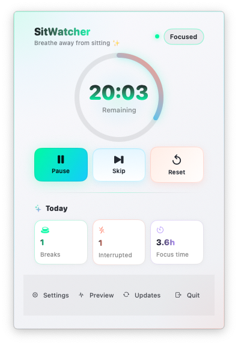<br />Menu bar panel · light</td>
    <td align="center">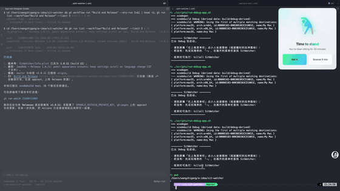<br />Floating reminder · ≈1s</td>
  </tr>
  <tr>
    <td align="center">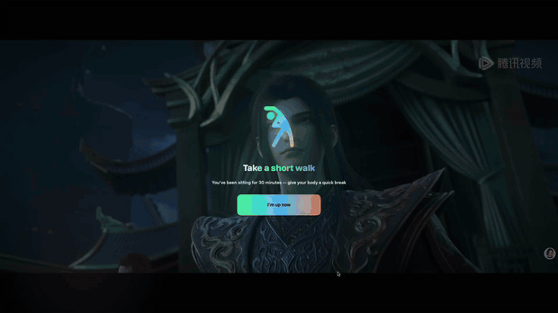<br />Full-screen reminder · ≈1s</td>
    <td align="center">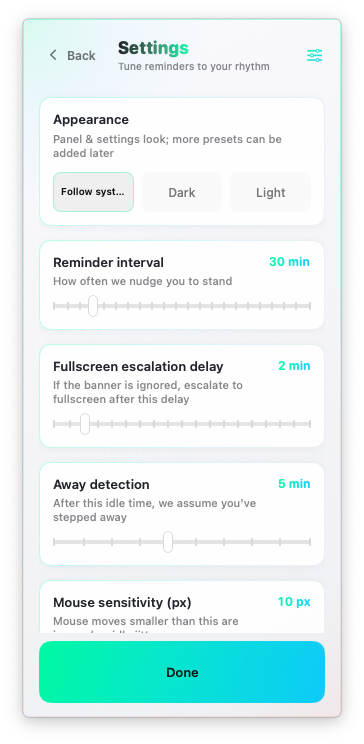<br />Settings · light</td>
  </tr>
</table>

### Dark appearance

<table>
  <tr>
    <td align="center">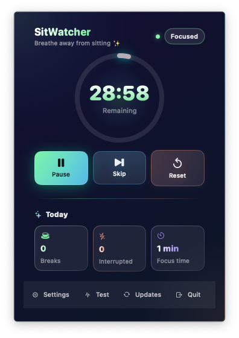<br />Menu bar panel · stats</td>
    <td align="center">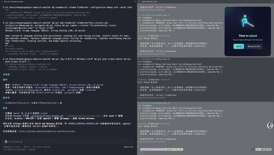<br />Floating reminder</td>
  </tr>
  <tr>
    <td align="center">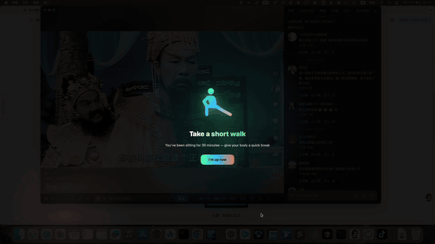<br />Full-screen reminder</td>
    <td align="center">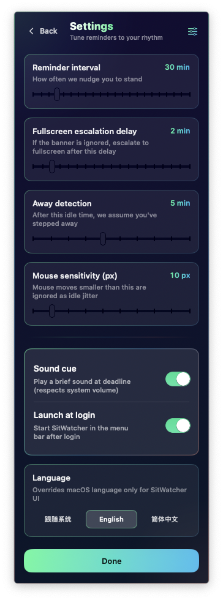<br />Settings · intervals</td>
  </tr>
</table>

### Chinese UI snapshots

<details>
<summary><strong>Show Chinese UI previews</strong> (GIFs tuned for Zh strings)</summary>

**Light**

<table>
  <tr>
    <td align="center">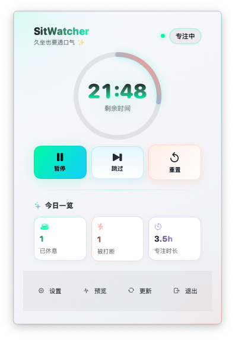<br />菜单栏面板 · 浅色</td>
    <td align="center">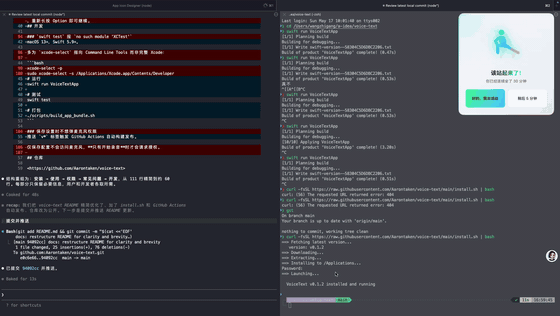<br />浮窗提醒 · 浅色</td>
  </tr>
  <tr>
    <td align="center">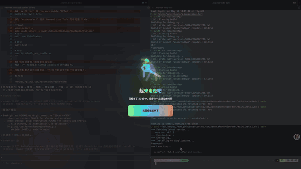<br />全屏提醒 · 浅色</td>
    <td align="center">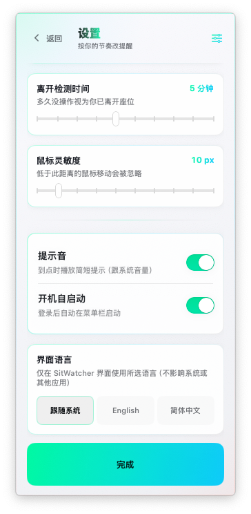<br />设置 · 浅色</td>
  </tr>
</table>

**Dark**

<table>
  <tr>
    <td align="center"><br />Menu bar panel</td>
    <td align="center">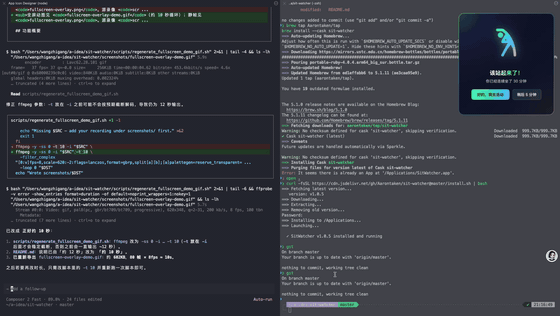<br />Floating reminder</td>
  </tr>
  <tr>
    <td align="center">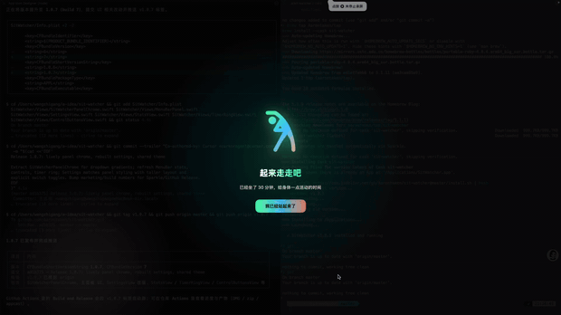<br />Full-screen reminder</td>
    <td align="center"><br />Settings</td>
  </tr>
</table>

</details>

<sub>Light-appearance GIFs: first ≈1s from <code>录屏*-浅色模式*.mov</code> — run <code>bash scripts/regenerate_light_mode_demo_gifs.sh</code>. Dark English / Chinese demos: <code>bash scripts/regenerate_floating_demo_gif_en.sh</code> · <code>bash scripts/regenerate_fullscreen_demo_gif_en.sh</code> and Zh <code>bash scripts/regenerate_floating_demo_gif.sh</code> · <code>bash scripts/regenerate_fullscreen_demo_gif.sh</code>. Source <code>.mov</code> stays local/gitignored — install ffmpeg.</sub>

## Features

- Circular menu‑bar countdown plus simple daily counters (stretch breaks taken, interruptions, approximate focus streaks on the timeline we track)  
- “Idle-aware” pacing that tries to approximate real stepping away versus tiny mouse jitter scripts  
- Tweak reminders, escalation delay, dwell thresholds for “away”, pointer sensitivity knobs  
- **[Sparkle](https://sparkle-project.org/)**‑based checks for newer builds from inside the menu bar extras

## Installation

### 1) One‑liner installer (recommended)

Installs whatever the latest Release packages into Applications and launches SitWatcher:

```bash
curl -fsSL https://cdn.jsdelivr.net/gh/Aarontaken/sit-watcher@master/install.sh | bash
```

Raw GitHub (note the branch **`master`** here):

```bash
curl -fsSL https://raw.githubusercontent.com/Aarontaken/sit-watcher/master/install.sh | bash
```

### 2) Homebrew

```bash
brew tap Aarontaken/tap
brew install --cask sit-watcher
```

### 3) Manual

Grab `SitWatcher.dmg` under [Releases](https://github.com/Aarontaken/sit-watcher/releases); mount → run **`Install.app`**.

Maintainers can sanity‑check downloader logic without spraying `/Applications` via `bash scripts/verify-install.sh` after editing `install.sh`.

## Building from sources

```bash
brew install xcodegen create-dmg
xcodegen generate
./scripts/build.sh
```

Or Xcode → SitWatcher scheme → Run (⌘R).

## System requirements

- macOS Sonoma (14)+  
- Works on Apple Silicon and Intel installs

## License

MIT