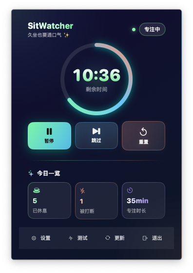
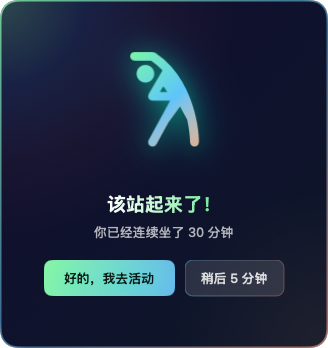
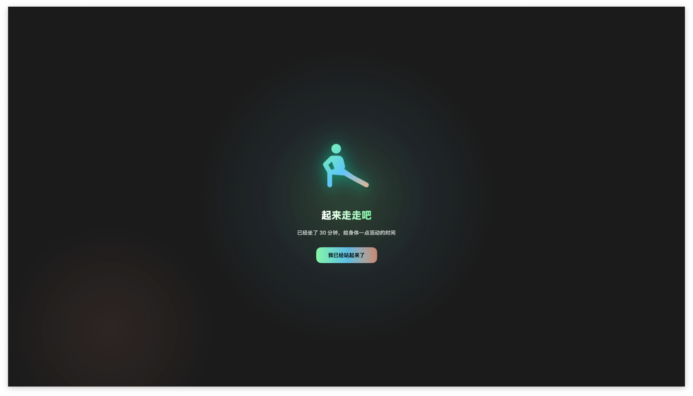
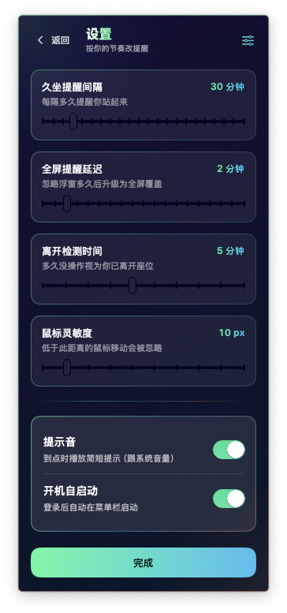

# SitWatcher · macOS 久坐提醒

**SitWatcher** 是一款运行在 **Mac 菜单栏** 上的开源 **久坐提醒 / 久坐提示 / 起身提醒 / 站立提醒** 小工具：久坐倒计时结束后先弹出浮窗，可延后；若长时间不理会会升级为全屏遮罩，直到你确认「已经站起来」，帮你打断连续久坐。

如果你在用 GitHub 搜索 **「久坐提醒」「久坐提示」「久坐」「起身提醒」「站立提醒」「菜单栏提醒」**，本项目就是这些关键词所指的一类工具——专治「一坐一下午忘了动」。

## 久坐提醒（久坐提示）是怎么工作的？

1. **倒计时**：按你在设置里配置的间隔（默认可调）倒计时剩余久坐时间。  
2. **浮窗**：到时后出现提醒窗口，可确认起身或延后几分钟。  
3. **全屏**：若持续忽略浮窗，会在「全屏提醒延迟」到期后铺满屏幕强化提醒（仍为同一套久坐逻辑）。  
4. **离开检测**：鼠标键盘长时间无操作时视为暂时离开，计时自动暂停，回来再继续。

## 预览

<table>
  <tr>
    <td align="center"><br />菜单栏面板 · 久坐统计</td>
    <td align="center"><br />浮窗久坐提醒</td>
  </tr>
  <tr>
    <td align="center"><br />全屏久坐提醒</td>
    <td align="center"><br />设置 · 间隔与延迟</td>
  </tr>
</table>

## 功能概要

- **久坐计时**：菜单栏环形倒计时与今日起身次数、专注时长等统计  
- **智能暂停**：离开座位自动暂停久坐计时，并可区分真实操作与脚本鼠标抖动  
- **可调参数**：久坐间隔、全屏升级延迟、离开判定阈值、鼠标灵敏度等  
- **自动更新**：内置 [Sparkle](https://sparkle-project.org/)，可在应用内检查新版本  

## 安装

**1. 一行脚本（推荐）** — 安装最新 Release 到 `/Applications` 并启动：

```bash
curl -fsSL https://cdn.jsdelivr.net/gh/Aarontaken/sit-watcher@master/install.sh | bash
```

也可用 GitHub raw（分支名为 **`master`**，不要用 `main`）：

```bash
curl -fsSL https://raw.githubusercontent.com/Aarontaken/sit-watcher/master/install.sh | bash
```

**2. Homebrew**

```bash
brew tap Aarontaken/tap
brew install --cask sit-watcher
```

**3. 手动** — [Releases](https://github.com/Aarontaken/sit-watcher/releases) 下载 `SitWatcher.dmg`，双击挂载后用 **`Install.app`** 安装。

---

开发者修改过 `install.sh` 后，可在仓库根目录执行 `bash scripts/verify-install.sh` 做下载解压自检（不写 `/Applications`）。

## 从源码构建

```bash
brew install xcodegen create-dmg
xcodegen generate
./scripts/build.sh
```

或用 Xcode 打开生成的工程，选中 **SitWatcher** 运行（⌘R）。

## 系统要求

- macOS 14（Sonoma）及以上  
- Apple Silicon / Intel  

## License

MIT
